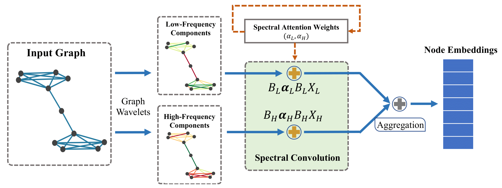

# SpGAT

This is a TensorFlow implementation of Spectral Graph Attention Network with Fast Eigen-approximation (**SpGAT**).

Heng Chang, Yu Rong, Tingyang Xu, Wenbing Huang, Somayeh Sojoudi, Junzhou Huang, Wenwu Zhu, [Spectral Graph Attention Network with Fast Eigen-approximation](https://dl.acm.org/doi/abs/10.1145/3459637.3482187), CIKM 2021.

<div align=center>
 
</div>

## Requirements
* python3
* tensorflow (tested on 1.12.0)
* networkx
* numpy
* scipy
* sklearn

Anaconda environment is recommended.

## Run the code
To replicate the result of SpGAT on Cora:
```bash
python train.py
```
To replicate the result of SpGAT_Cheby on Cora:
```bash
python train.py --model SpGAT_Cheby
```

## Acknowledgement
This repo is modified from [GWNN](https://github.com/Eilene/GWNN), and we sincerely thank them for their contributions.

## Reference
- If you find ``SpGAT`` useful in your research, please cite the following in your manuscript:

```
@article{chang2020spectral,
  title={Spectral Graph Attention Network with Fast Eigen-approximation},
  author={Chang, Heng and Rong, Yu and Xu, Tingyang and Huang, Wenbing and Sojoudi, Somayeh and Huang, Junzhou and Zhu, Wenwu},
  journal={arXiv preprint arXiv:2003.07450},
  year={2020}
}
```

